<!-- omit from toc -->
# Guild War Plan (GWP) v.1

`Authors: 虚无`

`Version Notes:`

- first guide so the numbers are just adjusted accordingly based from 30-man team.

`Assumptions:`

- currently have 21 players and all 21 will be present

`Terminologies:`

- Fortune Tree - the plant that must be escorted back to home base akin to Flag in Capture the Flag
- Bulwark - the towers located at top, mid, and bot
- Jungle - the PVE neutral camps scattered across the map

---
<!-- omit from toc -->
## Credits & Sources

- [Guild War ADVANCED Strategy Guide by Whispers of the Wind](https://www.youtube.com/watch?v=i_31EXGfoko)
- [Guild Wars Guide by TheForthWall](https://steamcommunity.com/app/3564740/discussions/0/816973559978027362/)
- [Objectives & Commander Skills by Points and Pixels](https://www.youtube.com/watch?v=bUvjblH3LuM)

---
<!-- omit from toc -->
## Table of Contents

- [1. Guild War Preparation Phase](#1-guild-war-preparation-phase)
  - [Pre-battle Buff Strategy](#pre-battle-buff-strategy)
    - [Bathhouse Buff](#bathhouse-buff)
    - [Script and Food Buffs](#script-and-food-buffs)
- [2. Team Composition](#2-team-composition)
  - [Roles and Responsibilities](#roles-and-responsibilities)
  - [Team 1 (T1) - Main Force](#team-1-t1---main-force)
    - [T1 - Objectives](#t1---objectives)
    - [Composition (for 13-man T1)](#composition-for-13-man-t1)
  - [Team 2 (T2) - Push Team](#team-2-t2---push-team)
    - [T2 - Objectives](#t2---objectives)
    - [Composition (for 4-man T2)](#composition-for-4-man-t2)
  - [Team 3 (T3) - Spec Ops](#team-3-t3---spec-ops)
    - [T3 - Objectives](#t3---objectives)
    - [Composition (for 4-man T3)](#composition-for-4-man-t3)
- [3. Commander Buffs](#3-commander-buffs)
- [4. Win/Loss Logic](#4-winloss-logic)
- [5. Recommended Mystic Skills](#5-recommended-mystic-skills)
- [6. Final Thoughts](#6-final-thoughts)

---

## 1. Guild War Preparation Phase

### Pre-battle Buff Strategy

#### Bathhouse Buff

Before battle, go to the bathhouse of your associated character's sex and purchase the ==All-in-one go==
service which costs **40 Commerce Coin (CC)**.
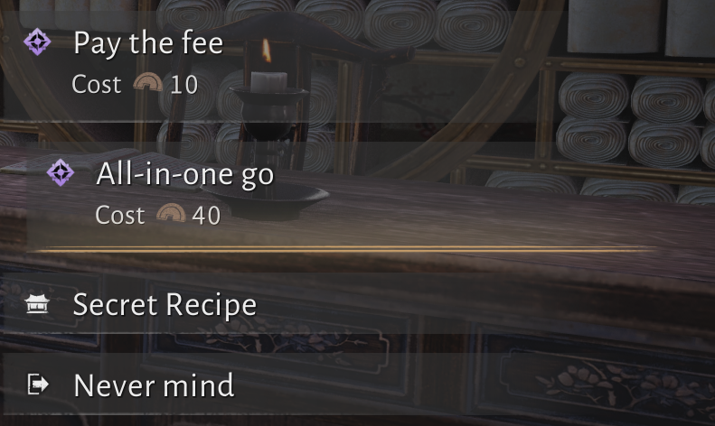
If the option is not yet available for you, you have to choose ==Pay the fee== option first for **10 CC** and when ever the NPC asks you if you want more massage, continue paying **10 CC**.

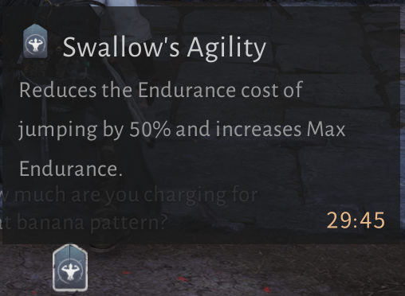
<!-- omit from toc -->
##### Locations

*Bathhouse for Male Characters*
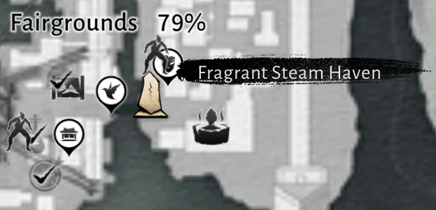

*Bathhouse for Female Characters*
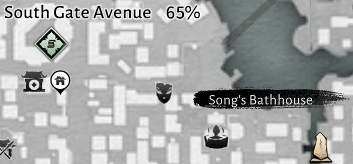

You can also get this buff by soaking at the Springwave Pavilion 2nd floor for **free** but it may take a while (*around 7 minutes*).
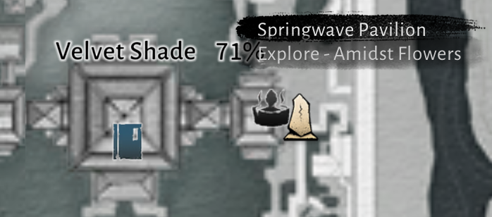

#### Script and Food Buffs

Optionally you can take these buffs as they stack with the bathhouse buff.
<!-- omit from toc -->
##### Script

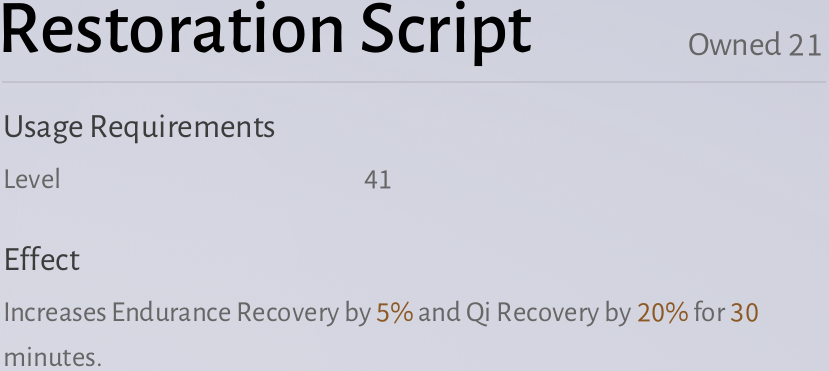
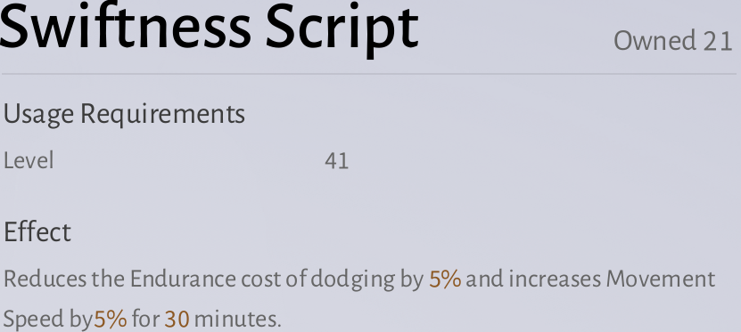
<!-- omit from toc -->
##### Food

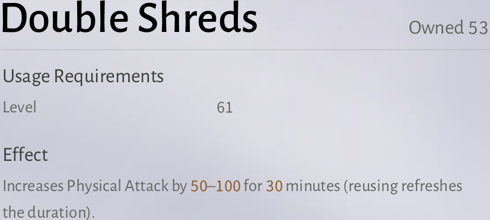
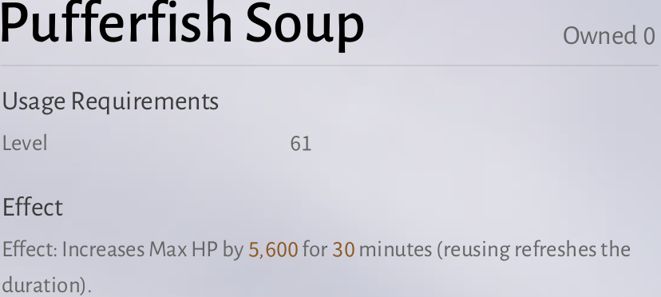

*Note: Taking 2 scripts does not work but taking 1 script and 1 food works.*

---

## 2. Team Composition

Notes: make sure to check the footnotes for the team compositions

### Roles and Responsibilities

(*EX skills are unlocked at higher Hall of Wonder levels, its understandable if you don't have this yet.*)

Healers
: Keep the team alive. Also stay safe and covered, once you go down, everyone goes down.

Tanks
: You are responsible for soaking damage, taking aggro, and protecting members.
Must have EX skills:
Mo Dao EX - enhanced taunt
Stormbreaker Spear EX - give super armor and damage reduction to nearby members

DPS
: You deal damage. Inkwell fan users can also use the Wind Wall to block the choke point at the middle map.
Notable EX skills:
Inkwell Fan EX: create a box prison
Nameless Sword EX: be immune to Qi Damage

Halftime Performers
: (*Halftime Show happens at 20 minute mark*) If you win the 1v1, prioritize taking the 20% damage against enemy Goose, otherwise choose the 60% damage against middle Bulwark (see [Win/Loss Logic](#4-winloss-logic)). The Arena talent tree is also activated here so having that skill tree maxxed or capped the better.

<!-- omit from toc -->
#### Commander Setup & Role

**Setup** (recommended but not necessary)

- Umbrella with flight skill raises vision over wide battlefield for better observation

**Role** (...)

- observe and assess situations
- activate buffs during critical moments
- must be Sun Tzu

<!-- omit from toc -->
#### Team Captains

**Role** (...)

- Assess your team needs and situation. For example, when about to push, relay info to Commander to activate necessary buff. As buffs have short durations, crucial timing matters. (Also as far as I'm aware, only Commanders can use buffs.)

Note: There can be 2 (max) commanders. The other commander can be assigned to manage Team 2 and 3 when first Commander is focused on Team 1.

<!-- omit from toc -->
#### Individual Responsibilities

- Everyone is encouraged to upgrade Guild Talents, even if they are not participating, the upgraded talent contributes to the total bonus damage (Technique > Martial Teaching > Wu Liangjie (Priority) > Others)
- Do not stand in front of ally carrying the Tree. Stay on the side while defending the carrier.
- Guard the ally carrying the Tree.
- Block the enemy carrying the Tree.
- Healers can respawn allies but do not respawn when ally died near base because they will respawn with very low health, just let them revive from base.

### Team 1 (T1) - Main Force

Ideally, this team should be composed of 20 players on a 30-man team, however since we only have 21 participating members, the number is adjusted to 12 for GWP v.1.

#### T1 - Objectives

As the core fighting units, they are engaged in major battles.

- they must control mid and not let enemy mid team breakthrough
- break the enemy middle Bulwark ASAP (must do these, else the escort job will be hard)
- defeat enemy Goose
- escort plant back to home base

#### Composition (for 13-man T1)
<!-- omit from toc -->
##### Variant 1 (Offensive)

- 2 Healers
- 2 Tank [^1]
- 9 DPS [^2]
<!-- omit from toc -->
##### Variant 2 (Defensive)[^3]

- 4 Healers
- 3 Tanks
- 6 DPS

[^1]: take turns tanking, make sure not to die, when nearing low HP, switch with partner tank and go get healed in the back line, switch back when ready
[^2]: ideally nameless sword and umbrella users for range harass and quickly melting mid Bulwark
[^3]: much more forgiving than Offensive Variant, especially if no cracked tank in guild yet

### Team 2 (T2) - Push Team

#### T2 - Objectives

They are deployed on side lanes (top and bot).

- quickly demolish the top and bot enemy Bulwarks, doing so greatly weakens the enemy Goose
- retreat to the base to defend Goose when enemy deploys assassins to the Goose
- carry chicken bombs and launch them towards enemy Bulwarks and Goose

#### Composition (for 4-man T2)

- 3 DPS[^4]
- 1 Healer

[^4]: consists of strategic and twinblade users as their skill sets are more suitable for skirmishes or small scale battle and single-target DPS

### Team 3 (T3) - Spec Ops

The most disciplined team. Can be deployed anywhere. Carry out operations in hostile environments to secure strategic or operational advantages. Must be fast, efficient, and rotate wherever needed ASAP.

#### T3 - Objectives

- clear out neutral camps, especially early in the game, to farm ==Fun Coins== (the most valuable resource in GvG and are used to buy [Commander Buffs](#3-commander-buffs) and Battlefield Props)
- the early farm will be the main driving force of all team so farming all neutral camps (including invading enemy camps to cripple their economy) ASAP is crucial (camps respawns every 5 minutes)
- after farming and waiting for respawn time, they must rejoin **T2** to defend the base in case of multiple invaders or rejoin **T1** to push, commit attack, or assassinate enemy healers from the back line
- terminating mini-bosses who gives big rewards. These bosses respawns at the 15 and 25 minute marks respectively. The first boss gives massive amount of ==Fun Coins== while the second boss gives buff called **Blood Nirvana** *(still looking for info what this gives exactly)*
- *(optional for now)* must have **Ghost Bind** for fast camp clears (2-3 fully maxed Ghost speeds up camp clear so much), the earlier the camps are cleared the faster T3 can join other teams.

#### Composition (for 4-man T3)

- similar with **T2**

## 3. Commander Buffs

Note: check footnotes

| Buff Name  | Cost   | Description   |
|-------------- | :--------------: | -------------- |
| Frontline Zeal    | Variable[^5]     | increases damage by X% against Bulwark and Goose, increases Movement Speed by X%, damage dealt by X%, and escort movement speed by X% **PERMANENT** *(most important buff, must be prioritize to max ASAP)*     |
| Hair Pulling    | 300     | increases allies' damage against Goose by 100% for 10 seconds (must be used when preparing to do big number damages against goose)     |
| Sprint    | 500     | increases movement speed when carrying the Fortune Tree by 100%     |
| Relentless Advance    | 1000     | makes allies carrying the Fortune Tree ignore interception for 5 seconds (combo with sprint if escorting thru battle or moving the tree outside the enemy base as enemy goose can interrupt carrier)     |
| Last Stand    | 1000     | reduces all allies' respawn time by 30% for 1 minute. **Last Stand**: When you are 2 turrets behind, reduces respawn time by 60% instead.     |
| Bounty Strike    | 1000     | increase all allies' damage to the enemy player moving the Fortune Tree by 40% for 10 seconds.     |
| Desperate Surge    | 500     | reduces all enemies' healing received by 60% for 15 seconds. (use this when tank uses AoE Taunt as it's most likely a batte is about to happen)     |
| You Got a Problem?    | 300     | increase allies' damage against Bulwarks by 100% for 10 seconds     |
| Refight    | 2000     | reduces the remaining cooldowns of all allies' Martial Art Ultimates (EX variation of special skills) by 50% and increases the damage and healing dealt over the next 30 seconds by 10%. **Last Stand**: When you are 2 bulwarks behind, immediately resets the Martial Art Ultimate cooldowns of all allies instead     |
| City Protection    | 1000     | protects all Bulwarks and the Goose from damage for 20 seconds     |

[^5]: increases as stack increases

Extra Notes:

- Restock the chicken bombs with using any extra fun coins. Team 2 and 3 should pick up one before leaving base to throw at enemy goose or bulwark. A chicken bomb buffed with You Got a Problem? or Hair Pulling can do 100k+ damage easy!
- Buff Timing is crucial. It can flip battles. Assigned Team Captain must communicate their situation to Commander clearly.

## 4. Win/Loss Logic

Note: in order of priority

1. Instant Win - Fortune Tree delivered from enemy base to home base
2. Distance Check - Who moved the Fortune Tree closer to their home base
3. Bulwark Check - Who have less destroyed Bulwarks
4. Bulwark HP Check - Who have higher remaining Bulwark HP

## 5. Recommended Mystic Skills

| Icon  | Name   | Usage   |
|-------------- | -------------- | -------------- |
| 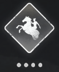    | **Flaming Meteor**     | (can delete healers fast, how to use: **Target Lock** Healer, enemies will natural gather around healer so you will hit more and the more you hit the harder the skill hits)     |
| 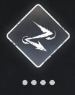    | **Ghost Bind**     | speeds up clearing neutral camps (*must have for **T3***)     |
| 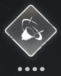    | **Lion's Roar**     | AoE Damage plus **SILENCE**     |
| 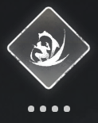    | **Leaping Toad**     | **inflict venom** before using Lion's Roar for more damage (*first jump inflicts venom*)     |

## 6. Final Thoughts

- if you are low on HP and there are no healers nearby and you really need to heal up because you have no more potions, you can mount the bulwark to recover to full HP, but this is not free, you are recovering your HP at the expense of the Bulwarks HP so use this only when absolutely necessary
- craft arrows for poking if you are melee
- Coordination > individual skill
- AoE healing is extremely strong — protect healers
- Commander buffs can flip fights instantly
- Friendly matches are unlimited — use them to practice
